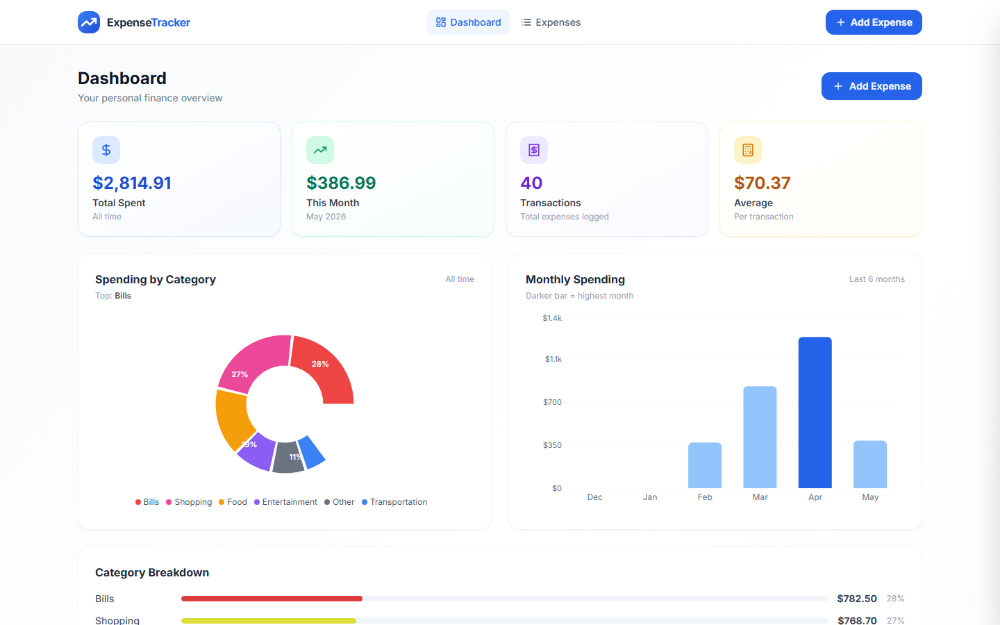
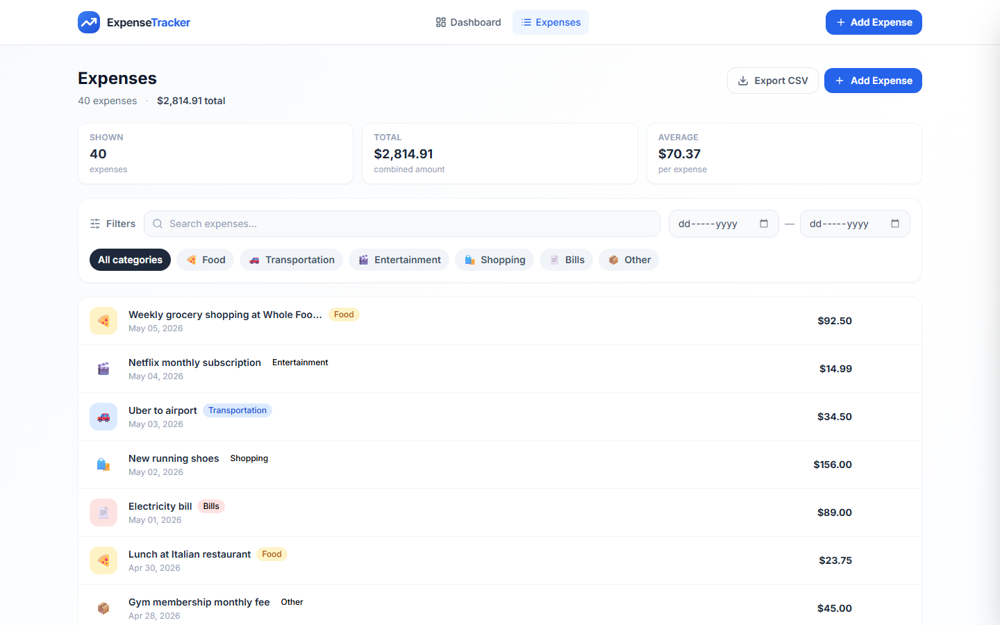
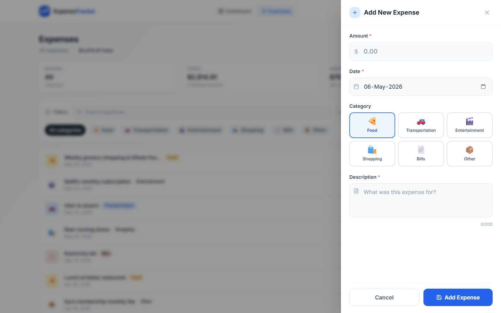

# ExpenseTracker

A modern, professional expense tracking web application built with Next.js 14. Track your personal finances with a clean dashboard, spending analytics, and full expense management.



## Features

- **Dashboard** — Summary cards, category pie chart, monthly bar chart, and category breakdown with progress bars
- **Expense Management** — Add, edit, and delete expenses with a smooth slide-in drawer
- **Filtering** — Search by description, filter by category, and filter by date range
- **Analytics** — Visual spending breakdown across 6 categories over the last 6 months
- **CSV Export** — Export any filtered view to a spreadsheet
- **Persistent Storage** — All data saved in browser localStorage
- **Sample Data** — 40 realistic expenses pre-loaded on first visit

## Tech Stack

| Layer | Technology |
|---|---|
| Framework | Next.js 14 (App Router) |
| Language | TypeScript |
| Styling | Tailwind CSS |
| Charts | Recharts |
| Icons | Lucide React |
| Date Utilities | date-fns |

## Getting Started

### Prerequisites

- Node.js 18+
- npm

### Installation

```bash
# Clone the repo
git clone https://github.com/farhan435/expense-tracker-ai.git
cd expense-tracker-ai

# Install dependencies
npm install

# Start the development server
npm run dev
```

Open [http://localhost:3000](http://localhost:3000) in your browser.

### Build for Production

```bash
npm run build
npm start
```

## Project Structure

```
expense-tracker-ai/
├── app/
│   ├── layout.tsx          # Root layout — wraps all pages with navbar and context
│   ├── page.tsx            # Dashboard page
│   ├── globals.css         # Global styles
│   └── expenses/
│       └── page.tsx        # Expenses list page
├── components/
│   ├── Navbar.tsx          # Top navigation bar
│   ├── SummaryCard.tsx     # Stat card (Total, Monthly, etc.)
│   ├── CategoryPieChart.tsx
│   ├── MonthlyBarChart.tsx
│   ├── RecentExpenses.tsx
│   ├── ExpenseFormDrawer.tsx  # Add / edit slide-in panel
│   ├── ExpenseFilters.tsx     # Search, category chips, date range
│   ├── ExpenseList.tsx
│   ├── ExpenseItem.tsx
│   ├── DeleteModal.tsx
│   ├── CategoryBadge.tsx
│   └── EmptyState.tsx
├── context/
│   └── ExpenseContext.tsx  # Global state — expenses, drawer, CRUD actions
└── lib/
    ├── types.ts            # TypeScript interfaces
    ├── constants.ts        # Categories with colors and emojis
    ├── storage.ts          # localStorage helpers
    ├── utils.ts            # Formatting, calculations, CSV export
    └── sample-data.ts      # Seed data for first-time visitors
```

## Expense Categories

| Category | Emoji |
|---|---|
| Food & Dining | 🍕 |
| Transportation | 🚗 |
| Entertainment | 🎬 |
| Shopping | 🛍️ |
| Bills & Utilities | 📄 |
| Other | 📦 |

## Screenshots

### Dashboard


### Expenses List


### Add Expense


## License

MIT
